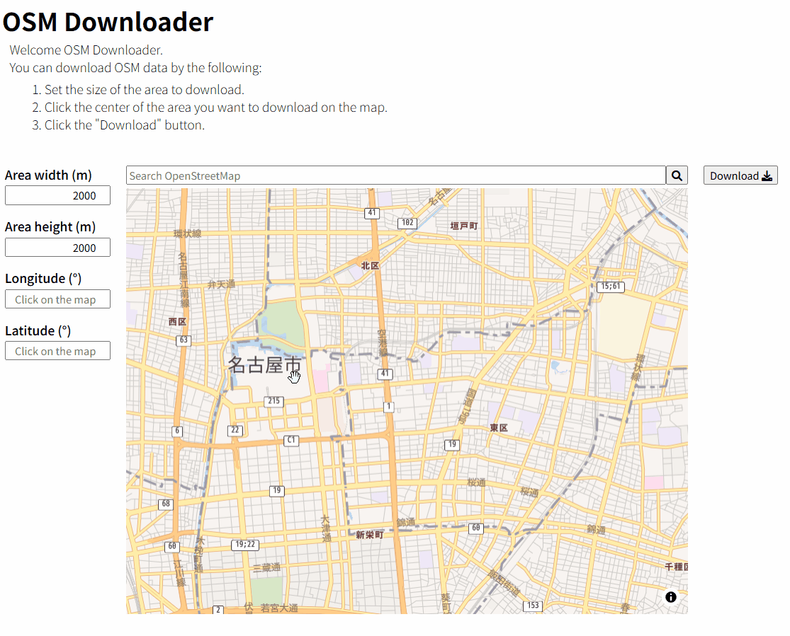
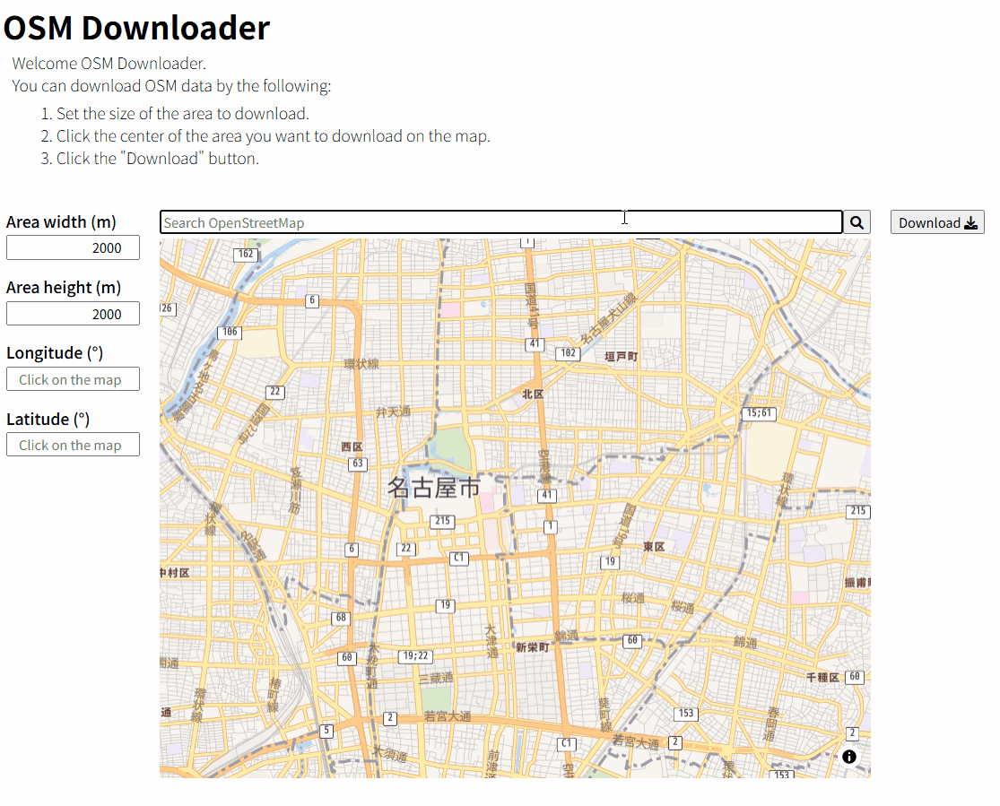
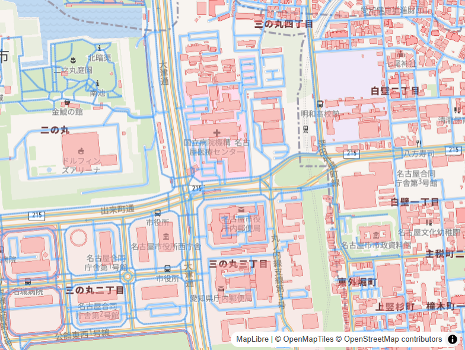

# OSM Downloader

The OSM Downloader (
https://nononoexe.github.io/osmdownloader/) is a web application for downloading OSM data for RoboCupRescue Simulation Map🗺️
You can download map data of a specified size centered on any location you click.
Downloaded OSM data can be viewed in JOSM and converted to GML format using osm2gml for use in RoboCupRescue Simulation.

> OSM DownloaderはRoboCupRescue Simulationの地図のためのOSMデータをダウンロードできるWebアプリケーションです。
> クリックした箇所を中心に指定したサイズの地図データをダウンロードすることができます。
> ダウンロードしたOSMデータはJSOMで確認することができます。
> また、osm2gmlを使ってGML形式に変換することでRoboCupRescue Simulationで利用することができます。

## 🚀Usage

You can download OSM data by the following:

1. Set the size of the area to download.
2. Click the center of the area you want to download on the map.
3. Click the "Download" button.

> 次の手順でダウンロードしてください。
> 1. ダウンロードしたい地図のサイズを設定
> 2. ダウンロードする領域の中心をクリック
> 3. 「ダウンロード」ボタンをクリック

## 🚩Features

Search for locations by area name.

> ダウンロードしたい場所を検索することもできます。

Downloaded data highlights buildings in red and roads in blue.

> ダウンロードされたデータのうち、建物は赤色、道路は青色で表示されます。

## License

This project is [MIT](LICENSE) licensed.
