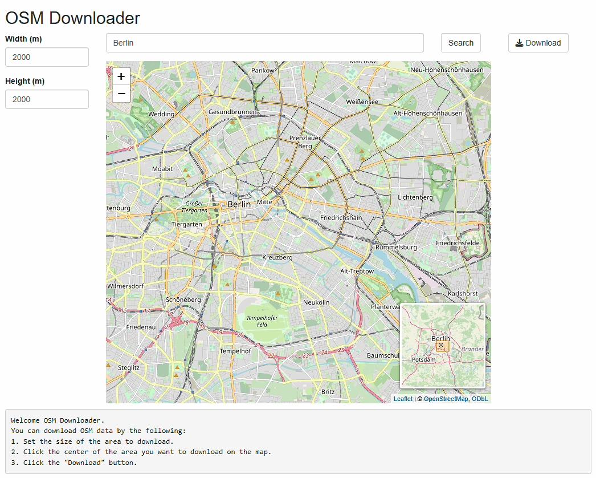

# OSM Downloader

The OSM Downloader is a web application for downloading OSM data🗺️
You can download map data of a specified size centered on the clicked location.

> OSM DownloaderはOSMの地図データをダウンロードするためのWebアプリケーションです。
> クリックした箇所を中心に指定したサイズの地図データをダウンロードすることができます。



## 🚀Usage

This application is using Shiny, a library for web application development in R.
Therefore, you must install R (≥ 4.1.0) beforehand; check the official R website (<https://www.r-project.org/>) for information on how to install R.

> このアプリケーションはRのWebアプリケーション開発用ライブラリであるShinyを使っています。
> そのため、事前にRをインストールしておく必要があります。Rのインストール方法については、Rの公式サイト（<https://www.r-project.org/>）を確認してください。

You can start the application by executing the following command in the terminal:

> アプリケーションは以下のコマンドをターミナルで実行することで起動できます。

### Windows

```bat
rem Download the application
git clone https://maslab.aitech.ac.jp/gitlab/ando/osmdownloader.git
cd osmdownloader

.\start.bat
```

### macOS / Linux

```sh
# Download the application
git clone https://maslab.aitech.ac.jp/gitlab/ando/osmdownloader.git
cd osmdownloader

.\start.sh
```

The application is opened in your default browser.
If you want to exit the application, terminate the process with Ctrl + C, etc.

> アプリケーションは既定のブラウザで開きます。
> また、Ctrl + Cなどで終了するときはプロセスを終了してください。

# License

This project is [MIT](LICENSE) licensed.
